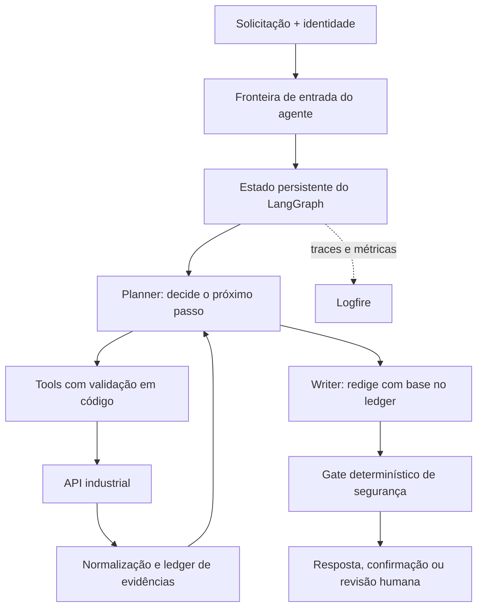
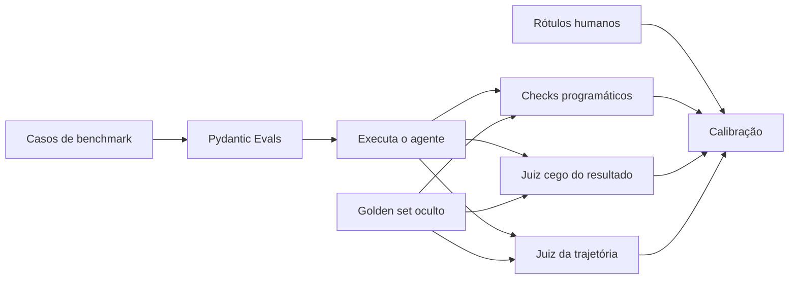

# Agente industrial TRACTIAN × Inteli

Projeto individual de engenharia de agentes para atendimento industrial, desenvolvido por [Leunam Sousa de Jesus](https://www.linkedin.com/in/leunam).

O sistema deverá receber uma solicitação, investigar dados por APIs, explicar sua decisão com evidências e executar somente ações permitidas. O foco atual é o backend e o aprendizado prático da arquitetura; não há frontend no escopo inicial.

> **Estado atual:** existem o simulador FastAPI, dados, contratos, cenários, cliente HTTP assíncrono, dez tools LangChain de leitura, cinco proposal tools sem efeito, política determinística, cinco operações HTTP fixas, estado tipado, fronteira Python, grafo LangGraph com planner LLM opt-in e checkpointer SQLite de desenvolvimento. Após a correção do adapter Groq em 02/09/2026, `make test` passou com 59 testes da API e 1.445 do agente (1.504 no total); permanece somente o `PendingDeprecationWarning` conhecido de `python_multipart`. As Fases 1 a 6 estão concluídas. O grafo atual não é um agente de produção: writer, resposta gerada ao cliente, ledger completo, gate de liberação, Logfire e runner Pydantic Evals continuam planejados em [`TASKS.md`](./TASKS.md).

## Problema

O agente atende três tipos de solicitação:

- **Contextualizar:** consultar conhecimento e explicar de forma responsável;
- **Investigar:** consultar ativos, análises e dados técnicos para recomendar próximos passos;
- **Executar:** propor ou realizar uma ação permitida, ou encaminhar para revisão humana.

Se faltarem evidências, houver conflito ou a ação ultrapassar a permissão do usuário, o agente não inventa uma conclusão. Ele solicita dados, confirmação ou revisão humana.

## Arquitetura planejada



Existe **um agente lógico com dois papéis de LLM**:

1. o **planner** escolhe entre investigar, pedir informação, propor uma ação ou encerrar;
2. o **writer** recebe somente a decisão e as evidências necessárias para produzir a resposta.

Essa separação reduz contexto, facilita testes e impede que a redação altere silenciosamente a decisão. LangGraph controla estado, nós, transições, interrupções e retomadas. Código determinístico continua responsável por identidade, permissão, argumentos, justificativa, idempotência e liberação da resposta.

No MVP, planner e writer podem usar o mesmo modelo com prompts e contratos diferentes. A separação é de responsabilidade, não uma obrigação de contratar dois modelos.

No desenho final, o **ledger de evidências** associará afirmações às fontes consultadas no estado da execução. O Logfire receberá traces e métricas para consulta humana e operação; ele não será o banco principal do ledger nem uma fonte que o agente consulta durante o atendimento. Nenhum dos dois componentes está implementado nesta entrega.

### Persistência e idempotência

Há dois armazenamentos SQLite independentes no desenvolvimento. A API usa `IDEMPOTENCY_DB_PATH` (padrão `.run/idempotency.sqlite3`) para a idempotência de reprocesso; `IDEMPOTENCY_PROCESSING_TIMEOUT_SECONDS` altera seu limite de processamento, cujo padrão é 300 segundos. O grafo usa `.run/agent-checkpoints.sqlite3` por `AsyncSqliteSaver`, com serializer restrito e sem remoção automática de threads; a exclusão é explícita. PostgreSQL continua sendo a evolução futura, não uma implementação atual.

- `thread_id` identifica a linha persistida; um thread pode receber novos `request_id`, e cada execução ou retomada recebe novo `execution_id`. Mudança de caso, empresa, pessoa usuária ou alvo confiável falha fechada.
- A intenção persistida registra ID, request, escopo imutável, hash, decisão/status, tentativas, execução preparadora e recibo ou erro; runtime, cliente, credenciais, seed, golden set, resposta HTTP bruta e raciocínio não entram no checkpoint.
- Criação e retomada que podem escrever usam `durability="sync"`; `prepare_intent` fica em superstep distinto e é persistido antes de `execute_action`. Confirmações usam `interrupt()` estruturado e `Command` pelo ID na fronteira confiável.
- O primeiro alvo de idempotência é `POST /analyses/{analysisId}/reprocess`.
- A API exige uma `Idempotency-Key` de 1 a 255 caracteres sem espaços, reserva a intenção antes da ação, persiste respostas concluídas em SQLite e faz replay mesmo após recriar o armazenamento; mesma chave com payload diferente retorna `409 Conflict`.
- O fluxo determinístico de reprocesso cria `tractian-agent:<uuid>` uma única vez após `allow`, persiste-a antes do HTTP e a reutiliza somente em, no máximo, um retry com o mesmo corpo. Cliente, proposal tools e operações não criam retries.
- A reserva é atômica: enquanto a primeira chamada está em execução, uma chamada concorrente com a mesma intenção recebe `409 IDEMPOTENCY_IN_PROGRESS` e não cria outra ação. Uma falha inesperada durante a ação marca o resultado como `uncertain`; retries recebem `409 IDEMPOTENCY_OUTCOME_UNKNOWN` em vez de repetir a ação.
- Um registro `processing` com mais de 300 segundos, ou o limite definido em `IDEMPOTENCY_PROCESSING_TIMEOUT_SECONDS`, muda para `uncertain` sem repetir a ação.
- Registros vencidos são removidos sob demanda depois de 7 dias; a mesma chave, após esse prazo, inicia uma nova execução. O horário de criação identifica cada geração e impede que um trabalho antigo altere a reserva nova.
- Se a resposta se perde depois do commit, o retry recupera a resposta persistida sem repetir a ação.
- Especialista, criticidade, retreinamento e escalonamento não usam chave nem retry automático: têm no máximo um despacho. Em retomada de uma intenção `prepared` por outro `execution_id`, terminam conservadoramente em `uncertain/0` sem tocar a rede. Isso pode produzir falso incerto e `attempts` pode subcontar um crash pós-efeito; o lock por `thread_id` é local ao processo/event loop e o preflight do especialista é opaco.

### Modelos

`ModelProvider` é a interface comum para construir `BaseChatModel` a partir do
`ModelConfig` estrito. O adapter inicial é `GroqModelProvider`, com
`openai/gpt-oss-120b`, temperatura zero, timeout de 30 segundos, no máximo 512
tokens e sem retry oculto. O planner usa `bind_tools` para uma escolha por
turno e uma chamada Pydantic separada para encerrar. No adapter Groq, essa
finalização usa o JSON Schema nativo estrito (`method="json_schema"`,
`strict=True`); a correção evita o `tool_use_failed` observado quando o default
`function_calling` criava uma tool sintética que GPT-OSS podia não chamar. Para
schemas Pydantic, o adapter valida diretamente o texto JSON com
`model_validate_json`: valores de Enum mantêm a semântica do wire JSON, enquanto
os validators e as regras de coerência do contrato continuam falhando fechados.
O planner e seu contrato permanecem independentes desse detalhe de transporte.
O modelo, credenciais e respostas brutas não entram no estado. IDs persistidos
de tool call são derivados pelo runtime de `request_id` e do ordinal, nunca do
ID externo do provider. NVIDIA NIM continua alternativa futura; writer poderá
usar outro modelo quando existir, sem mudar as regras de negócio.

O smoke opt-in `make smoke-groq` compara `openai/gpt-oss-120b` e
`openai/gpt-oss-20b` com dados sintéticos, sem retry e com o mesmo orçamento de
512 tokens da configuração inicial. A finalização usa o contrato real
`PlannerTerminalDecision` e exige `guide`, `sufficient_evidence` e informação
ausente nula. Por padrão há uma rodada por modelo e a estabilidade é declarada
como `not_measured`; defina
`GROQ_SMOKE_RUNS=2` ou maior para comparar as assinaturas dos contratos entre
rodadas. Ele exige `GROQ_API_KEY` já disponível no ambiente, não lê `.env` e só
imprime métricas agregadas seguras. Sem a chave, sai com código zero e
`status=skipped reason=missing_groq_api_key`, sem tocar a rede. No aceite desta
entrega, o smoke ao vivo inicialmente ficou **skipped** porque a chave não
estava disponível. Na verificação manual posterior, o 120b passou os dois
contratos; o 20b passou a seleção e falhou na finalização com o orçamento antigo
de 128 tokens. Um probe isolado confirmou `json_validate_failed` em 128 e
conclusão válida em 512, com `finish_reason=stop`, 171 tokens de saída, 150 deles
de raciocínio e Pydantic válido. A repetição do smoke completo depois desta
correção de orçamento e parser continua pendente e não é declarada aprovada.

## Avaliação offline planejada

Avaliação não participa do atendimento ao cliente nem provoca retries automáticos no runtime.



- **Checks programáticos:** contratos, tools, argumentos, permissões, erros e regras críticas.
- **Juiz do resultado:** relevância, fidelidade às evidências, honestidade, decisão, clareza e tom.
- **Juiz da trajetória:** escolha e ordem das tools, falhas, repetições e momento de parada.
- **Humano:** cria 20–30 rótulos de referência e analisa concordância, falsos aprovados e falsos reprovados.

Os limiares `0.7`, `0.8` e `0.9` serão comparados; `0.8` é apenas o candidato inicial. Como haverá um único avaliador humano, Cohen's kappa mede humano × juiz. Krippendorff alpha fica fora do escopo atual.

O golden set nunca entra no runtime e não é consultado por RAG. Ele é visível apenas aos avaliadores depois que a execução termina.

## Tecnologias

| Responsabilidade | Tecnologia | Motivo |
|---|---|---|
| API simulada | FastAPI | Contrato HTTP e testes rápidos |
| Orquestração | LangGraph + LangChain | Estado, ciclos, tools e retomada |
| Contratos | Pydantic | Tipagem e validação explícitas |
| Cliente HTTP | httpx | Chamadas assíncronas e testáveis |
| Modelos | Groq; NVIDIA NIM candidato | Início gratuito e troca por adapter |
| Persistência | SQLite; PostgreSQL futuro | Simplicidade local e caminho de escala |
| Observabilidade | Pydantic Logfire | Traces e investigação sem criar dashboard |
| Testes | pytest | Unidade, integração e regressão |
| Avaliação | Pydantic Evals | Casos, avaliadores e experimentos tipados |

`promptfoo` poderá comparar prompts e modelos quando o pipeline estiver estável. `Ragas` só será adotado se o produto ganhar uma etapa real de RAG.

## Executar o que já existe

Requisitos: Python 3.10 ou superior e [`uv`](https://docs.astral.sh/uv/).

```bash
make setup   # instala API/agente e gera os dados
make up      # inicia a API em http://localhost:8000
make test    # executa as suítes da API e do agente
make logs    # acompanha o log da API
make stop    # encerra a API iniciada pelo Makefile
```

O Swagger fica em `http://localhost:8000/docs`. Ações usam o header `x-user-id`. O parâmetro `seed` reproduz variações; `seed=complete` pede retornos completos quando o cenário não possui override fixo.

## Desenvolvimento com uma IA copiloto

1. Abra [`AGENTS.md`](./AGENTS.md) para dar contexto e regras à IA.
2. Escolha a primeira fase incompleta e sem dependências em [`TASKS.md`](./TASKS.md).
3. Estude o conceito correspondente em [`LEARNING-GUIDE.md`](./LEARNING-GUIDE.md).
4. Peça à IA uma explicação curta, um micro-objetivo e critérios de teste — não a implementação inteira.
5. Implemente você mesmo uma mudança pequena; use a IA para revisar, explicar erros e sugerir testes.
6. Marque a tarefa concluída somente quando seus critérios de aceite passarem.

Prompt curto recomendado:

> Leia `AGENTS.md`, `TASKS.md` e a etapa relevante de `LEARNING-GUIDE.md`. Atue como professor e copiloto. Explique os conceitos sem assumir conhecimento prévio, defina um único micro-objetivo e seus testes. Não escreva a solução completa antes da minha tentativa; revise o código que eu produzir.

## Documentação

| Arquivo | Função |
|---|---|
| [`AGENTS.md`](./AGENTS.md) | Regras obrigatórias para qualquer IA ou contribuidor |
| [`TASKS.md`](./TASKS.md) | Backlog linear, decisões pendentes e critérios de aceite |
| [`LEARNING-GUIDE.md`](./LEARNING-GUIDE.md) | Conceitos a aprender na ordem de construção |
| [`CONTEXT.md`](./CONTEXT.md) | Vocabulário canônico do domínio |
| [`docs/api-contract.openapi.yaml`](./docs/api-contract.openapi.yaml) | Contrato HTTP fornecido |
| [`docs/data-schema.md`](./docs/data-schema.md) | Estrutura dos dados fornecidos |
| [`docs/test-scenarios.md`](./docs/test-scenarios.md) | Cenários comentados do benchmark |

## Estrutura

```text
.
├── README.md
├── AGENTS.md
├── TASKS.md
├── LEARNING-GUIDE.md
├── CONTEXT.md
├── LICENSE
├── Makefile
├── agent/                   # contratos, cliente, tools, política, operações, estado, grafo e checkpointer
├── agent-input/             # entradas permitidas ao agente
├── api/                     # simulador FastAPI e testes
├── data/                    # dados do simulador
├── docs/                    # contrato, schema e cenários
└── eval/                    # gabarito restrito aos avaliadores
```

## Limitações atuais

- Existe um grafo LangGraph com planner LLM opt-in, fluxos de escrita determinísticos e checkpointer. Ele ainda não possui writer, resposta gerada ao cliente, ledger completo, gate de segurança de liberação, Logfire nem runner Pydantic Evals; portanto não é um agente de produção.
- As cinco proposal tools apenas propõem (`effect_executed=false`). Somente o fluxo determinístico, após política, confirmação quando necessária e checkpoint, acessa as cinco operações HTTP fixas.
- O simulador não representa todas as garantias transacionais de produção.
- O OpenAPI repete `/assets/{assetId}` em blocos separados; alguns parsers podem perder uma operação.
- Contrato e resposta atual de `Asset` não têm exatamente a mesma estrutura.
- Os cenários M-605 e S-420 possuem divergências entre descrição e dados; isso deve gerar incerteza, não adaptação silenciosa do gabarito.

## Autor

**Leunam Sousa de Jesus** — [LinkedIn](https://www.linkedin.com/in/leunam)

## Licença

O código original deste repositório é distribuído sob a [Licença MIT](./LICENSE). Dados, marcas e materiais originados da TRACTIAN, do Inteli ou de terceiros continuam sujeitos aos direitos de seus respectivos titulares.
