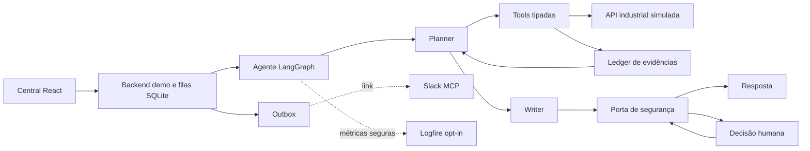

# Agente industrial TRACTIAN × Inteli

Projeto individual de engenharia de agentes para atendimento industrial,
desenvolvido por [Leunam Sousa de Jesus](https://www.linkedin.com/in/leunam).

O sistema recebe um caso, consulta dados industriais por APIs, organiza as
evidências e produz uma orientação ou propõe uma ação. Escritas só atravessam
fronteiras determinísticas de identidade, permissão, confirmação,
idempotência e segurança. Uma central React permite experimentar o fluxo com
casos e pessoas simuladas.

## Escopo e estado atual

A entrega técnica está completa e reproduzível localmente. Ela inclui:

- simulador industrial FastAPI com dados sintéticos;
- agente LangGraph com planner, tools e writer;
- ledger de evidências e porta determinística de segurança;
- cinco fluxos de escrita com confirmação, autorização e idempotência;
- revisão humana persistente e retomável;
- adapters para Groq e NVIDIA NIM, com fallback por disponibilidade;
- avaliação offline com checks programáticos e juízes separados;
- central React, filas SQLite e notificações pelo MCP oficial do Slack;
- testes de API, agente, backend, frontend, navegador e smokes reais opt-in.

Isso não significa que o agente esteja pronto para produção. O benchmark ao
vivo mais recente teve 33 `model_failure` em 34 execuções e nenhuma execução
passou o conjunto integral. Também faltam 20–30 rótulos cegos de especialistas
da TRACTIAN para calibrar os juízes. O pipeline detecta e registra essas
limitações em vez de convertê-las em aprovação.

## O core em um minuto

1. A fronteira de entrada valida caso, empresa, pessoa e identificadores.
2. O planner escolhe consultar uma tool, pedir informação, propor uma ação ou
   encerrar.
3. As tools consultam a API e devolvem observações tipadas.
4. O ledger registra fatos, fontes, conflitos e lacunas no estado.
5. O writer redige somente com a decisão e as referências permitidas.
6. A porta de segurança revalida evidências, permissões e intenções em código.
7. Se necessário, o fluxo pausa para confirmação, autorização ou revisão e
   retoma do checkpoint sem repetir efeitos.

Planner e writer são dois papéis de LLM dentro de um único agente lógico. O
planner decide o caminho; o writer não pode alterar essa decisão. LangGraph
controla estado e transições, enquanto regras críticas permanecem em Python.

## Arquitetura



| Componente | Por que existe |
|---|---|
| `api/` | Simula o produto industrial e oferece contratos HTTP reproduzíveis. |
| `agent/` | Mantém o grafo, contratos, tools, política, ledger, writer e avaliação. |
| `demo/` | Separa a experiência da API industrial e hospeda filas, decisões e workers. |
| `frontend/` | Permite conversar, trocar pessoas simuladas e responder decisões. |
| Pydantic | Rejeita coerções e payloads fora dos contratos esperados. |
| LangGraph | Persiste o estado e torna interrupções e retomadas explícitas. |
| SQLite | Fornece checkpoints, idempotência e filas locais sem infraestrutura externa. |
| Pydantic Evals | Organiza execuções offline, checks, juízes e artefatos versionados. |
| Logfire | Recebe somente traces manuais e sanitizados quando habilitado. |

### Evidência e segurança

O ledger aceita observações validadas de leitura e recibos tipados de ações. A
resposta só pode citar fatos liberados pela porta de segurança. Texto livre de
LLM, prompts, respostas brutas e notas dos juízes não viram evidência.

Consultas são autônomas. Escritas exigem um pedido explícito e, conforme risco
e permissão, confirmação da pessoa solicitante ou autorização de uma pessoa
com cargo compatível. O estado persiste a intenção antes do HTTP. Reprocesso
usa chave idempotente; as outras ações têm no máximo um despacho automático e
terminam como `uncertain` quando o efeito remoto é ambíguo.

O runtime nunca recebe o golden set, as trajetórias esperadas nem os dados
privados da avaliação. Credenciais, payloads, targets e respostas de modelo não
são enviados ao Logfire nem expostos ao frontend.

### Providers e fallback

`ModelProvider` oferece a mesma interface para Groq e NVIDIA NIM. A configuração
inicial usa Groq como principal e NIM como fallback; a ordem pode ser alterada
por ambiente.

Fallback ocorre somente para `timeout`, erro de rede, `429` ou `5xx`. Erro de
schema, parsing, policy, gate ou qualidade não é mascarado por outro provider.
O smoke real sonda os dois providers e injeta um timeout exclusivamente na
fronteira de teste para comprovar o roteamento de forma determinística.

### Decisões humanas e Slack

Revisão técnica da equipe TRACTIAN e autorização da empresa são públicos
distintos. O backend resolve novamente a pessoa simulada, empresa e permissão;
o navegador nunca envia uma lista de permissões confiável.

O pedido de decisão e o evento de outbox são gravados juntos. O Slack recebe
somente categoria, resumo sanitizado, IDs opacos e um link para a central. A
aprovação acontece no frontend, não no Slack. Falha remota ambígua fica
`uncertain` e não provoca reenvio automático.

## Executar localmente

Requisitos:

- Python 3.10 ou superior;
- Node.js 20 ou superior;
- Chrome ou Chromium;
- [`uv`](https://docs.astral.sh/uv/).

Prepare o ambiente:

```bash
cp .env.example .env
make setup
```

Para usar o agente ao vivo, preencha `GROQ_API_KEY` e `NVIDIA_API_KEY` no
`.env`. As variáveis do Slack são opcionais para a central e obrigatórias
somente para notificações reais. Nunca versione o `.env`.

Inicie a demonstração:

```bash
make demo
```

Serviços locais:

- central: `http://localhost:5173`;
- backend da demonstração: `http://localhost:8100/docs`;
- API industrial simulada: `http://localhost:8000/docs`.

Use `make logs` para acompanhar os processos e `make stop` para encerrá-los.

### Testes e aceite

```bash
make test          # pytest, Vitest, build TypeScript e Playwright
make eval          # 17 casos × 2, sem LLM ou rede
make accept        # locks, segurança, testes e avaliação offline
make accept-live   # accept + providers reais + dois canais Slack
```

`make accept-live` consome cota dos providers e envia duas notificações
sintéticas ao Slack configurado. Os relatórios sanitizados ficam em
`.run/smoke/`, que não é versionado.

Comandos opt-in separados:

```bash
make smoke-groq       # contratos dos modelos Groq disponíveis
make smoke-fallback   # Groq, NIM e fallback por timeout controlado
make smoke-slack-e2e  # fila, Slack, decisão REST e retomada
make eval-live        # benchmark do agente real
make eval-providers   # comparação Groq × NVIDIA NIM
make eval-judges      # juízes sobre relatório já encerrado
```

O último `make accept-live` validou 99 testes da API, 1.813 do agente, 32 do
backend demo, 4 do frontend, build Vite, 2 fluxos Playwright, 34 execuções
offline, conectividade Groq/NIM, fallback controlado e entrega/retomada nos dois
canais Slack.

### Configurar o Slack MCP

Crie uma Slack App interna, habilite o MCP e conclua OAuth com o escopo mínimo
`chat:write`. Depois preencha no `.env`:

```dotenv
SLACK_MCP_ACCESS_TOKEN=
SLACK_TRACTIAN_CHANNEL_ID=
SLACK_AUTHORITY_CHANNEL_ID=
PUBLIC_APP_URL=http://127.0.0.1:5173
```

O endpoint utilizado é `https://mcp.slack.com/mcp`. Em uma demonstração fora
da máquina local, `PUBLIC_APP_URL` precisa apontar para uma central acessível às
pessoas que receberão o link.

## Avaliação

O runner executa os casos públicos antes de carregar as trajetórias esperadas.
Checks programáticos validam formato, decisão, tools, argumentos, IDs,
permissões, justificativa, erros e orçamento de passos. Depois da execução:

- o juiz de resultado recebe a resposta sem o trace;
- o juiz de trajetória recebe apenas chamadas e falhas sanitizadas;
- nenhum juiz libera respostas, executa ações ou aciona retry no atendimento.

A calibração humana está preparada, mas propositalmente não concluída. Uma
pessoa especialista da TRACTIAN deverá rotular 20–30 respostas sem ver as notas
dos juízes. Só então faz sentido escolher limiar, medir concordância, Cohen's
kappa, falsos aprovados e falsos reprovados.

## Estrutura e documentação

```text
.
├── api/                    # simulador FastAPI
├── agent/                  # agente, segurança e avaliação
├── agent-input/            # casos públicos permitidos ao runtime
├── demo/                   # fachada, filas, decisões e Slack MCP
├── frontend/               # central React
├── data/                   # dados sintéticos do simulador
├── docs/                   # contratos de dados, API e cenários
├── eval/                   # referências reservadas à avaliação
├── AGENTS.md               # regras para futuras alterações por IA
├── CONTEXT.md              # vocabulário canônico do domínio
└── Makefile                # comandos de operação e aceite
```

Documentos técnicos ativos:

- [`CONTEXT.md`](./CONTEXT.md): termos de domínio e avaliação;
- [`docs/data-schema.md`](./docs/data-schema.md): schema dos dados sintéticos;
- [`docs/test-scenarios.md`](./docs/test-scenarios.md): cenários do benchmark;
- [`docs/api-contract.openapi.yaml`](./docs/api-contract.openapi.yaml): contrato HTTP.

## Limitações

- Pessoas e permissões da central são simuladas; não há autenticação corporativa.
- SQLite é adequado à demonstração local; PostgreSQL é a evolução esperada.
- As ações da API devolvem recibos, mas não alteram os Parquets de origem.
- A URL local enviada ao Slack não funciona fora da máquina sem publicação.
- O benchmark atual impede classificar o agente como pronto para produção.
- A calibração final depende de especialistas industriais da TRACTIAN.

LangSmith e Phoenix não foram adicionados porque Pydantic Evals já organiza a
avaliação e Logfire cobre a observabilidade atual. Uma nova plataforma só se
justifica se surgir uma necessidade operacional que essas ferramentas não
cubram.

## Autor e licença

**Leunam Sousa de Jesus** — [LinkedIn](https://www.linkedin.com/in/leunam)

O código original usa a [Licença MIT](./LICENSE). Dados, marcas e materiais da
TRACTIAN, do Inteli ou de terceiros continuam sujeitos aos respectivos direitos.
