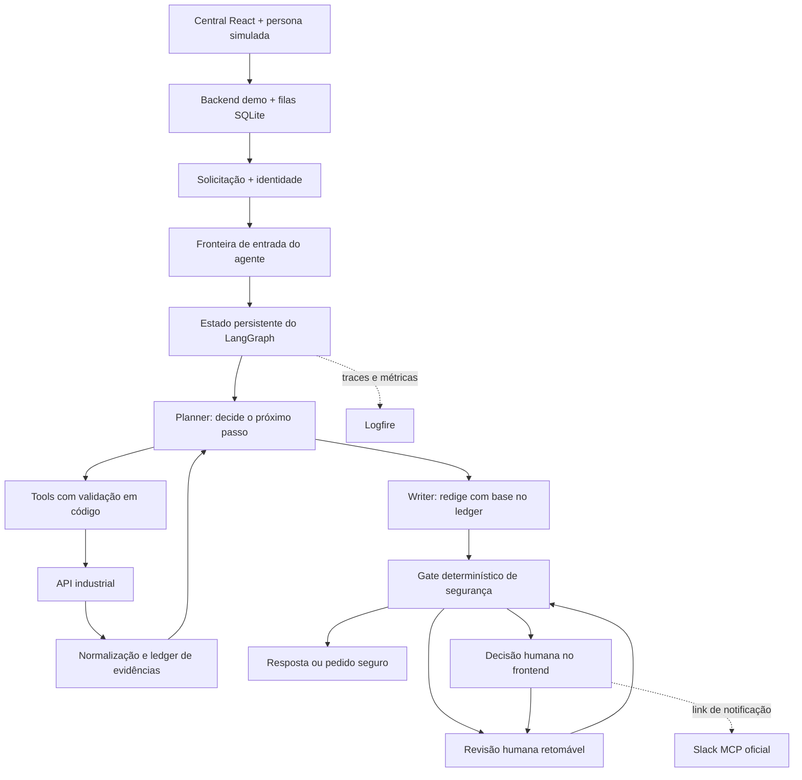
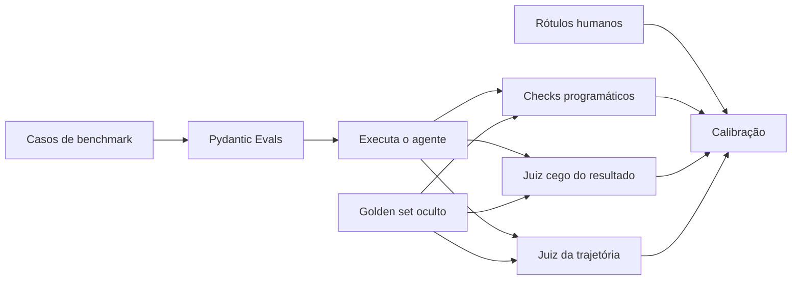

# Agente industrial TRACTIAN × Inteli

Projeto individual de engenharia de agentes para atendimento industrial, desenvolvido por [Leunam Sousa de Jesus](https://www.linkedin.com/in/leunam).

O sistema recebe uma solicitação, investiga dados por APIs, explica sua decisão com evidências e executa somente ações permitidas. Uma central React local permite demonstrar o fluxo real, alternar personas simuladas e resolver pedidos humanos sem transformar a interface em fonte de autorização.

> **Estado atual:** além do núcleo e da avaliação das Fases 1–12, 14 e 15, existem a fachada FastAPI `demo/`, filas SQLite, central React `frontend/`, decisões delegadas, outbox Slack MCP e fallback configurável Groq → NVIDIA NIM. As suítes locais usam doubles e não consomem credenciais. A calibração humana da Fase 13 continua adiada até uma pessoa especialista da TRACTIAN produzir os rótulos cegos. O smoke do Slack real depende de OAuth e dos dois canais do workspace; sem essa evidência a integração externa não é declarada validada. O benchmark atual revelou limitações de qualidade e o agente não é de produção.

## Problema

O agente atende três tipos de solicitação:

- **Contextualizar:** consultar conhecimento e explicar de forma responsável;
- **Investigar:** consultar ativos, análises e dados técnicos para recomendar próximos passos;
- **Executar:** propor ou realizar uma ação permitida, ou encaminhar para revisão humana.

Se faltarem evidências, houver conflito ou a ação ultrapassar a permissão do usuário, o agente não inventa uma conclusão. Ele solicita dados, confirmação ou revisão humana.

## Arquitetura atual e evolução planejada



Existe **um agente lógico com dois papéis de LLM**:

1. o **planner** escolhe entre investigar, pedir informação, propor uma ação ou encerrar;
2. o **writer** recebe somente a decisão e as evidências necessárias para produzir a resposta.

Essa separação reduz contexto, facilita testes e impede que a redação altere silenciosamente a decisão. LangGraph controla estado, nós, transições, interrupções e retomadas. Código determinístico continua responsável por identidade, permissão, argumentos, justificativa, idempotência e liberação da resposta.

No MVP, planner e writer podem usar o mesmo modelo com prompts e contratos diferentes. A separação é de responsabilidade, não uma obrigação de contratar dois modelos.

O writer usa o prompt `writer-v1`, não recebe tools e devolve somente um draft
estruturado com a decisão imutável, IDs ordenados e próximo passo enumerado. Seu
contexto usa um orçamento total de 64 referências e somente IDs e categorias
fechadas: alvos, valores, timestamps e caminhos técnicos permanecem no ledger.
O gate deriva a decisão e o alvo da ação da request confiável, da proposal, da
intenção, da aprovação e do recibo atuais; recompõe IDs e conflitos e exige
`read` sempre que o draft cita um fato de tool. Apenas um atestado `release`
permite ao renderer buscar os valores no ledger; a mensagem técnica não vem do
modelo e é revalidada ao restaurar o checkpoint. Uma saída de formato inválido
admite somente um repair; contador, âncora e próximo nó impedem uma terceira
chamada. Duas falhas, erro de provider ou qualquer incerteza terminam em aviso
sanitizado ou, quando aplicável, revisão humana.

A revisão humana é uma fronteira persistente e retomável: o pedido sanitizado é
gravado antes da interrupção e a identidade da pessoa revisora chega separada da
resposta. A aprovação só remove o motivo fechado `HUMAN_DISPOSITION_REQUIRED`
de um draft `GUIDE` que já passou pelas demais verificações e pediu disposição
humana como próximo passo; ela nunca transforma a decisão explícita
`REQUIRE_HUMAN_REVIEW` do planner em orientação. Edição limita-se à seleção e à
ordem das evidências atuais e ao próximo passo enumerado, e só é oferecida para
`HUMAN_DISPOSITION_REQUIRED`, `WRITER_FAILURE`,
`EVIDENCE_REFERENCE_MISMATCH` ou `NEXT_STEP_MISMATCH`; demais motivos aceitam
somente rejeição. Para `ACT` e `ESCALATE`, a seleção revisada precisa preservar
o fato `accepted` do recibo ligado à intenção atual. Toda retomada revalida
ledger, permissões e intenções; bloqueios duros, rejeição, expiração ou uma
segunda necessidade de revisão encerram de forma segura, sem executar ação.
O ID da revisão inclui o escopo do thread; contratos rejeitam coerções Python e
o envelope confiável de autoria, empresa, permissão, horário e reply fica ligado
à auditoria. Perda da permissão `read` não impede o fechamento interno seguro,
mas bloqueia qualquer retorno público do estado técnico, inclusive em replay.
O orçamento reserva o interrupt e o segundo gate antes de iniciar caminhos
revisáveis; checkpoints legados sem essa reserva terminam por contrato próprio.
No vencimento, a expiração precede a semântica da operação; uma nova solicitação
encerra primeiro a revisão vencida, sem reexecutar trabalho antigo. Antes de
qualquer mutação do checkpoint, a fronteira vincula novamente thread, caso,
empresa, pessoa, alvo central, modelo configurado, request e execução ao escopo
persistido, mesmo quando a request não declarou ativo. O gate-base original
permanece imutável durante drift de permissão; um contrato estrito derivado
distingue a continuação anterior ao julgamento daquela posterior à auditoria e
é removido depois do segundo gate.

O **ledger de evidências** associa fatos às fontes consultadas no estado da execução. Ele recebe somente observações de leitura validadas e recibos tipados de intenções terminais; texto livre de LLM, proposals e mensagens de recibo não viram fatos. A telemetria Logfire serve apenas à consulta humana e à operação; não é o banco principal do ledger nem uma fonte consultada pelo agente.

### Observabilidade manual e opt-in

`build_agent_graph(..., telemetry=...)` recebe uma fachada injetável. Sem
configuração explícita, `NullTelemetry` é usada e não importa nem configura o
SDK. `invoke_agent` mantém o retorno histórico `AgentState`, enquanto
`invoke_agent_observed` devolve esse mesmo estado com um `trace_id` opaco no
envelope. O ID técnico nunca entra no estado, no resultado final ou no SQLite.

A exportação requer simultaneamente:

- `TRACTIAN_LOGFIRE_ENABLED=true`, exatamente em minúsculas;
- um único `LOGFIRE_TOKEN`, sem espaços ou vírgulas e com até 4 KiB;
- `TRACTIAN_LOGFIRE_PSEUDONYM_KEY` com 32 bytes a 4 KiB em UTF-8.

Ausência ou formato local inválido mantém a fachada nula antes de carregar o
SDK. Os três valores são copiados uma única vez e a configuração usa exatamente
esse snapshot, inclusive quando a origem é um `Mapping` mutável. Revogação
remota do token não pode ser validada offline. O SDK é configurado uma vez na
construção e somente spans manuais são permitidos. Antes de importar qualquer
modelo, o pacote acrescenta `logfire-plugin` a `PYDANTIC_DISABLE_PLUGINS`
(preservando plugins existentes e os sentinelas globais), de modo que
LangChain/LangGraph, HTTPX, FastAPI e Pydantic não sejam auto-instrumentados.

Os nomes exportáveis são fixos: `tractian.agent.request`, `node`, `planner`,
`writer`, `tool`, `policy`, `action`, `gate`, `review`, `response` e
`evaluation`, todos sob o prefixo `tractian.agent.`. Atributos aceitam apenas
versão, enums/flags/contadores fechados, nomes de catálogo, `trace_id` e
referências HMAC. IDs literais, mensagens, argumentos, retornos, evidências,
targets, URLs, payloads, segredos e exceções não entram na telemetria. Métricas
usam somente `stage`, `outcome`, `error_code`, `planner_enabled` e `replayed`;
nenhum ID é label. O runtime emite zero spans de avaliação; o runner offline da
Fase 11 pode usar a operação tipada somente na fronteira de avaliação.

O span `action` começa somente quando um `POST` ou `PATCH` modificador é
despachado. Leituras de preflight não criam tentativa, e uma nova tentativa só
existe se um novo modificador alcançar o transporte. Falhas da fachada, do SDK,
de spans ou de métricas são isoladas inclusive quando levantam `BaseException`;
cancelamentos e exceções originados pelo negócio continuam sendo propagados com
a mesma identidade e traceback.

A retenção inicial de 30 dias e os limites de volume/cardinalidade são controles
operacionais externos da conta Logfire: devem ser configurados e monitorados
fora deste runtime. O código limita token/chave, contratos e labels, mas não
afirma controlar retenção do backend. Rotacionar a chave quebra deliberadamente
a correlação histórica dos pseudônimos.

O aceite integrado percorreu consulta completa, ledger, writer e gate; leituras
parciais, conflitantes, obsoletas e com falha; revisão humana após reabertura do
SQLite; cinco escritas, retry e replay; e exportação real em memória pelo SDK.
Subprocessos limpos provaram que o caminho padrão não carrega o Logfire nem o
plugin Pydantic. O span de resposta registra somente a decisão fechada e o
resultado operacional. A matriz focada passou com 71 testes, os fluxos de
escrita com 235 e `make test` com 99 testes da API e 1.759 do agente. O único
warning é a depreciação pendente já conhecida de `python_multipart` no Starlette.

### Persistência e idempotência

Há dois armazenamentos SQLite independentes no desenvolvimento. A API usa `IDEMPOTENCY_DB_PATH` (padrão `.run/idempotency.sqlite3`) para a idempotência de reprocesso; `IDEMPOTENCY_PROCESSING_TIMEOUT_SECONDS` altera seu limite de processamento, cujo padrão é 300 segundos. O grafo usa `.run/agent-checkpoints.sqlite3` por `AsyncSqliteSaver`, com serializer restrito e sem remoção automática de threads; a exclusão é explícita. PostgreSQL continua sendo a evolução futura, não uma implementação atual.

- `thread_id` identifica a linha persistida; um thread pode receber novos `request_id`, e cada execução ou retomada recebe novo `execution_id`. Mudança de caso, empresa, pessoa usuária ou alvo confiável falha fechada.
- A intenção persistida registra ID, request, escopo imutável, hash, decisão/status, origem da aprovação autorizadora, tentativas, execução preparadora e recibo ou erro; runtime, cliente, credenciais, seed, golden set, resposta HTTP bruta e raciocínio não entram no checkpoint.
- O estado persiste somente os três alvos confiáveis necessários à escrita — ativo central, caso atual e modelo industrial configurado — e os vincula novamente à request, à intenção e ao atestado; esse contexto nunca é enviado ao writer.
- A assinatura estrutural da intenção inclui ação, alvo canônico, parâmetros materiais e justificativa, e o runtime precisa coincidir com o contexto persistido em cada retomada. Esse hash detecta divergência, mas não é um MAC nem prova autenticidade contra alguém com escrita arbitrária no SQLite e capacidade de recalcular todo o checkpoint; por isso o banco de checkpoints permanece uma fronteira confiável e deve ter acesso controlado.
- Criação e retomada que podem escrever usam `durability="sync"`; `prepare_intent` fica em superstep distinto e é persistido antes de `execute_action`. Confirmações usam `interrupt()` estruturado e `Command` pelo ID na fronteira confiável.
- O primeiro alvo de idempotência é `POST /analyses/{analysisId}/reprocess`.
- A API exige uma `Idempotency-Key` de 1 a 255 caracteres sem espaços, reserva a intenção antes da ação, persiste respostas concluídas em SQLite e faz replay mesmo após recriar o armazenamento; mesma chave com payload diferente retorna `409 Conflict`.
- O fluxo determinístico de reprocesso cria `tractian-agent:<uuid>` uma única vez após `allow`, persiste-a antes do HTTP e a reutiliza somente em, no máximo, um retry com o mesmo corpo. Cliente, proposal tools e operações não criam retries.
- A reserva é atômica: enquanto a primeira chamada está em execução, uma chamada concorrente com a mesma intenção recebe `409 IDEMPOTENCY_IN_PROGRESS` e não cria outra ação. Uma falha inesperada durante a ação marca o resultado como `uncertain`; retries recebem `409 IDEMPOTENCY_OUTCOME_UNKNOWN` em vez de repetir a ação.
- Um registro `processing` com mais de 300 segundos, ou o limite definido em `IDEMPOTENCY_PROCESSING_TIMEOUT_SECONDS`, muda para `uncertain` sem repetir a ação.
- Registros vencidos são removidos sob demanda depois de 7 dias; a mesma chave, após esse prazo, inicia uma nova execução. O horário de criação identifica cada geração e impede que um trabalho antigo altere a reserva nova.
- Se a resposta se perde depois do commit, o retry recupera a resposta persistida sem repetir a ação.
- Especialista, criticidade, retreinamento e escalonamento não usam chave nem retry automático: têm no máximo um despacho. Em retomada de uma intenção `prepared` por outro `execution_id`, terminam conservadoramente em `uncertain/0` sem tocar a rede, antes de revalidar escopo, política ou preflight; somente a transição exata `prepare_intent → execute_action` recebe essa exceção na fronteira, mesmo se ativo, caso ou modelo do runtime mudaram. Isso pode produzir falso incerto e `attempts` pode subcontar um crash pós-efeito; o lock por `thread_id` é local ao processo/event loop e o preflight do especialista é opaco.
- No grafo com planner, esse único terminal de retomada é derivado do shape estrutural completo — ação não idempotente, intenção `uncertain/0` preparada por outra execução, sem recibo e com âncora `execute_action` — e exige erro `NON_IDEMPOTENT_OUTCOME_UNKNOWN_AFTER_RESUME` e resultado final canônicos. Somente ele segue diretamente para `END`, com mensagem determinística e sem writer/gate; qualquer outro erro ou resultado continua no writer e na porta de segurança.
- A API aplica uma segunda barreira de empresa nas ações ligadas a ativo, análise e chamado. Os cinco endpoints de ação retornam recibos sem reescrever os fixtures; o PATCH aceita somente o formulário técnico documentado e falha fechado para campos, tipos ou valores inválidos.
- O processo da API abre somente uma allowlist de Parquets operacionais e lê chamados do pacote público sanitizado em `agent-input/`. O `data/cases.parquet`, o gabarito em `eval/` e os cenários de teste não entram no runtime.

### Modelos

`ModelProvider` é a interface comum para construir `BaseChatModel` a partir do
`ModelConfig` estrito. O adapter inicial é `GroqModelProvider`; a configuração
live `evaluation-experiment-v5` usa `openai/gpt-oss-20b`, temperatura zero,
timeout de 30 segundos e no máximo 512 tokens. O adapter continua sem retry por
padrão. Somente o experimento live congela e registra três retries de transporte,
duas repetições do erro sanitizado `output_parse_failed` e pacing compartilhado
de 20 segundos entre planner e writer. O planner usa `bind_tools` para uma escolha por
turno e uma chamada Pydantic separada para encerrar. No adapter Groq, essa
finalização usa o JSON Schema nativo estrito (`method="json_schema"`,
`strict=True`); a correção evita o `tool_use_failed` observado quando o default
`function_calling` criava uma tool sintética que GPT-OSS podia não chamar. Para
schemas Pydantic, o adapter valida diretamente o texto JSON com
`model_validate_json`: valores de Enum mantêm a semântica do wire JSON, enquanto
os validators e as regras de coerência do contrato continuam falhando fechados.
O planner e seu contrato permanecem independentes desse detalhe de transporte.
O modelo, credenciais e respostas brutas não entram no estado. IDs persistidos
de tool call são derivados pelo runtime de `request_id` e do ordinal, nunca do
ID externo do provider. O adapter NVIDIA NIM usa a API OpenAI-compatible, aceita
o endpoint hospedado oficial ou um NIM local e mantém `max_retries=0`. O writer
pode usar outro modelo sem mudar as regras de negócio ou o gate determinístico.

O smoke opt-in `make smoke-groq` compara `openai/gpt-oss-120b` e
`openai/gpt-oss-20b` com dados sintéticos, sem retry e com o mesmo orçamento de
512 tokens da configuração inicial. A finalização usa o contrato real
`PlannerTerminalDecision` e exige `guide`, `sufficient_evidence` e informação
ausente nula. Por padrão há uma rodada por modelo e a estabilidade é declarada
como `not_measured`; defina
`GROQ_SMOKE_RUNS=2` ou maior para comparar as assinaturas dos contratos entre
rodadas. Ele exige `GROQ_API_KEY` já disponível no ambiente, não lê `.env` e só
imprime métricas agregadas seguras. Sem a chave, sai com código zero e
`status=skipped reason=missing_groq_api_key`, sem tocar a rede. No aceite desta
entrega, o smoke ao vivo inicialmente ficou **skipped** porque a chave não
estava disponível. Na verificação manual posterior, o 120b passou os dois
contratos; o 20b passou a seleção e falhou na finalização com o orçamento antigo
de 128 tokens. Um probe isolado confirmou `json_validate_failed` em 128 e
conclusão válida em 512, com `finish_reason=stop`, 171 tokens de saída, 150 deles
de raciocínio e Pydantic válido. Depois da correção de orçamento e parser, a
repetição completa aprovou ambos os modelos com português, tool, argumentos e
Pydantic válidos em duas chamadas. Como houve somente uma rodada, a estabilidade
permanece corretamente `not_measured`; as latências observadas não constituem
benchmark para escolher o modelo.

## Avaliação offline

Avaliação não participa do atendimento ao cliente nem provoca retries automáticos no runtime.



- **Checks programáticos:** contratos, tools, argumentos, permissões, erros e regras críticas.
- **Juiz do resultado:** relevância, fidelidade às evidências, honestidade, decisão, clareza e tom.
- **Juiz da trajetória:** escolha e ordem das tools, falhas, repetições e momento de parada.
- **Humano:** uma pessoa especialista cria 20–30 rótulos cegos e permite medir concordância, falsos aprovados e falsos reprovados.

O runner executa primeiro as entradas públicas e somente depois carrega
`eval/expected-paths.json`. Os relatórios registram configuração, hashes dos
arquivos, revisão do Git, versões de prompts/rubricas/modelos e dependências.
Cada rodada usa um checkpointer SQLite transitório e isolado; repetir o comando
no mesmo diretório não reutiliza estado do grafo nem altera os IDs observados.
Os checks cobrem formato, decisão, tools, argumentos, IDs, trajetória,
permissões, justificativa, erros e limite de passos. Os dois juízes são offline:
o juiz cego nunca recebe chamadas; o juiz de trajetória recebe apenas chamadas
e falhas já concluídas. Suas notas nunca retornam ao grafo.

O experimento real `tractian-eval-v1` executado em 03/09/2026 usou 17 casos,
duas repetições, Groq `openai/gpt-oss-20b` no agente e limite de 24 passos. As
34 execuções respeitaram formato, argumentos, IDs, permissões, justificativa,
tratamento de erro e orçamento, mas nenhuma passou o conjunto completo: 33
terminaram em revisão segura por `model_failure`, apenas uma passou a dimensão
de decisão e nenhuma reproduziu a trajetória esperada. Isso é evidência de que
o pipeline detecta regressões, não de qualidade do agente.

Uma auditoria de estabilização posterior executou ainda `tractian-eval-v2`,
`v3` e `v4`. Ela comprovou chamadas reais do planner e do writer, corrigiu
repetição de busca, finalização no teto de tools, parsing malformado e isolamento
de pacing. Também demonstrou um limite externo: cada modelo do plano gratuito
da Groq tem 200 mil tokens/dia, insuficientes para concluir no mesmo período as
34 trajetórias longas com todas as chamadas. As rodadas terminaram com falhas de
cota e **não** são evidência de 34/34 fluxos aprovados. A configuração `v5`
restaura o GPT-OSS 20B suportado e reproduz o controle de cota; para uma prova
live completa é preciso aguardar a renovação, elevar a cota ou autorizar outro
provider. O perfil local, os checks e os testes não dependem dessa cota.

Os juízes Groq `openai/gpt-oss-120b`, rubricas `v2`, JSON mode validado por
Pydantic e pacing de dez segundos avaliaram os mesmos 34 runs. Nenhuma saída
foi aprovada em `0.7`, `0.8` ou `0.9`; todos os 17 pares de repetição foram
instáveis. Checks + juízes não acrescentaram rejeições porque os checks já
haviam rejeitado os 34 runs. As 68 chamadas acumularam 468,4 s de latência do
provider, além do pacing. O custo ficou indisponível porque não há tarifa
versionada na configuração.

Os limiares `0.7`, `0.8` e `0.9` são reaplicados aos mesmos scores. Nenhum foi
escolhido: o autor não é especialista industrial da TRACTIAN e rotular por
suposição contaminaria o golden set. A Fase 13 está, portanto, **skipped por
ausência de avaliador de domínio**. Quando a equipe TRACTIAN estiver disponível:

1. rode `make eval-label-template EVAL_OUTPUT_DIR=<rodada>`;
2. leia `blind-review-packet.json` sem abrir `judge-report.json` ou
   `judge-scores.json`;
3. preencha os 20–30 campos `approved` e `reason` em `human-labels.json`;
4. rode `make eval-calibrate EVAL_OUTPUT_DIR=<rodada>`;
5. registre concordância bruta, Cohen's kappa, falsos aprovados/reprovados e o
   limiar justificado pelos erros observados.

Como haverá inicialmente uma única pessoa avaliadora, Cohen's kappa medirá
humano × juiz e não concordância entre especialistas. Krippendorff alpha fica
fora desta entrega.

O golden set nunca entra no runtime e não é consultado por RAG. Ele é visível apenas aos avaliadores depois que a execução termina.

## Tecnologias

| Responsabilidade | Tecnologia | Motivo |
|---|---|---|
| API simulada | FastAPI | Contrato HTTP e testes rápidos |
| Central de casos | React + TypeScript + Vite | Demonstração local com menu dinâmico e personas |
| Fachada e filas | FastAPI + SQLite | Persistência, SSE, decisões e outbox sem acoplar a API industrial |
| Orquestração | LangGraph + LangChain | Estado, ciclos, tools e retomada |
| Contratos | Pydantic | Tipagem e validação explícitas |
| Cliente HTTP | httpx | Chamadas assíncronas e testáveis |
| Modelos | Groq e NVIDIA NIM | Troca por adapter e benchmark comum |
| Persistência | SQLite; PostgreSQL futuro | Simplicidade local e caminho de escala |
| Observabilidade | Pydantic Logfire | Traces e investigação sem criar dashboard |
| Testes | pytest, Vitest e Playwright | Unidade, integração, concorrência, build e navegador real |
| Avaliação | Pydantic Evals | Casos, avaliadores e experimentos tipados |

No benchmark versionado de dois runs por papel com `openai/gpt-oss-20b`, Groq
passou português, tool calling, saída estruturada e estabilidade no planner e
writer. NVIDIA NIM passou o writer, mas falhou a saída estruturada/estabilidade
do planner. A latência total observada foi 1,735 s/1,039 s para planner/writer
na Groq e 6,361 s/21,335 s na NVIDIA. Groq é a recomendação sob essas condições;
o custo não foi comparado por ausência de tarifa congelada.

LangSmith e Phoenix não foram adicionados: Pydantic Evals já organiza o
benchmark e Logfire já cobre observabilidade, enquanto uma terceira plataforma
duplicaria coleta e aumentaria a superfície de exposição de traces. Phoenix
pode ser reconsiderado se surgir necessidade de uma UI self-hosted; LangSmith,
se o projeto adotar operacionalmente a plataforma LangChain. `promptfoo` só
entra quando comparações recorrentes justificarem outra ferramenta. `Ragas` só
entra se existir um pipeline RAG real.

## Executar o que já existe

Requisitos: Python 3.10 ou superior, Node.js 20+, Chrome e [`uv`](https://docs.astral.sh/uv/).

```bash
cp .env.example .env  # preencha somente credenciais que pretende usar
make setup   # instala API, agente, demo e frontend; gera os dados
make up      # inicia a API em http://localhost:8000
make demo    # inicia API, backend :8100, worker e frontend :5173
make test    # pytest + Vitest + build TypeScript + Playwright
make eval    # 17 casos x 2 no fallback local; sem credenciais ou rede
make eval-live EVAL_OUTPUT_DIR=.run/evaluation/minha-rodada EVAL_PROVIDER=groq
make eval-providers   # benchmark real Groq x NVIDIA NIM
make eval-judges EVAL_OUTPUT_DIR=.run/evaluation/minha-rodada
make eval-label-template EVAL_OUTPUT_DIR=.run/evaluation/minha-rodada
make eval-calibrate EVAL_OUTPUT_DIR=.run/evaluation/minha-rodada
make eval-layers EVAL_OUTPUT_DIR=.run/evaluation/minha-rodada
make smoke-slack      # opt-in: envia 1 aviso seguro em cada canal configurado
make logs    # acompanha os quatro processos locais
make stop    # encerra API, backend, worker e frontend
```

O Swagger industrial fica em `http://localhost:8000/docs`, o Swagger da fachada em `http://localhost:8100/docs` e a central em `http://localhost:5173`. Ações industriais usam `x-user-id`. O parâmetro `seed` reproduz variações; `seed=complete` pede retornos completos quando o cenário não possui override fixo.

### Configurar o Slack MCP

Crie ou reutilize uma Slack App interna, habilite o MCP e conclua OAuth com o escopo mínimo `chat:write`. Preencha somente no `.env` local `SLACK_MCP_ACCESS_TOKEN`, `SLACK_TRACTIAN_CHANNEL_ID` e `SLACK_AUTHORITY_CHANNEL_ID`. O endpoint usado é o oficial `https://mcp.slack.com/mcp`; o worker descobre a tool de envio no início da sessão. O Slack recebe apenas categoria, resumo sanitizado, IDs opacos e link. Aprovar ou rejeitar acontece exclusivamente na central.

Enquanto essas três variáveis não estiverem configuradas e `make smoke-slack` não passar, a central mantém as decisões funcionais, mas informa `slack_configured=false` e não promete entrega externa.

## Desenvolvimento com uma IA copiloto

1. Abra [`AGENTS.md`](./AGENTS.md) para dar contexto e regras à IA.
2. Escolha a primeira fase incompleta e sem dependências em [`TASKS.md`](./TASKS.md).
3. Estude o conceito correspondente em [`LEARNING-GUIDE.md`](./LEARNING-GUIDE.md).
4. Peça à IA uma explicação curta, um micro-objetivo e critérios de teste — não a implementação inteira.
5. Implemente você mesmo uma mudança pequena; use a IA para revisar, explicar erros e sugerir testes.
6. Marque a tarefa concluída somente quando seus critérios de aceite passarem.

Prompt curto recomendado:

> Leia `AGENTS.md`, `TASKS.md` e a etapa relevante de `LEARNING-GUIDE.md`. Atue como professor e copiloto. Explique os conceitos sem assumir conhecimento prévio, defina um único micro-objetivo e seus testes. Não escreva a solução completa antes da minha tentativa; revise o código que eu produzir.

## Documentação

| Arquivo | Função |
|---|---|
| [`AGENTS.md`](./AGENTS.md) | Regras obrigatórias para qualquer IA ou contribuidor |
| [`TASKS.md`](./TASKS.md) | Backlog linear, decisões pendentes e critérios de aceite |
| [`LEARNING-GUIDE.md`](./LEARNING-GUIDE.md) | Conceitos a aprender na ordem de construção |
| [`CONTEXT.md`](./CONTEXT.md) | Vocabulário canônico do domínio |
| [`docs/api-contract.openapi.yaml`](./docs/api-contract.openapi.yaml) | Contrato HTTP fornecido |
| [`docs/data-schema.md`](./docs/data-schema.md) | Estrutura dos dados fornecidos |
| [`docs/test-scenarios.md`](./docs/test-scenarios.md) | Cenários comentados do benchmark |

## Estrutura

```text
.
├── README.md
├── AGENTS.md
├── TASKS.md
├── LEARNING-GUIDE.md
├── CONTEXT.md
├── LICENSE
├── Makefile
├── agent/                   # contratos, tools, planner, writer, gate, grafo e checkpointer
├── agent-input/             # entradas permitidas ao agente
├── api/                     # simulador FastAPI e testes
├── demo/                    # fachada, SQLite, workers, decisões e Slack MCP
├── frontend/                # central React, Vitest e Playwright
├── data/                    # dados do simulador
├── docs/                    # contrato, schema e cenários
└── eval/                    # gabarito restrito aos avaliadores
```

## Limitações atuais

- Existe um grafo LangGraph com planner e writer LLM opt-in separados, ledger de evidências, gate determinístico, revisão humana retomável, fluxos de escrita, checkpointer, telemetria manual Logfire opt-in e avaliação Pydantic Evals. O benchmark atual falha em qualidade/estabilidade e a calibração humana está adiada; portanto não é um agente de produção.
- As cinco proposal tools apenas propõem (`effect_executed=false`). Somente o fluxo determinístico, após política, confirmação quando necessária e checkpoint, acessa as cinco operações HTTP fixas.
- O simulador não representa todas as garantias transacionais de produção.
- A central usa identidades simuladas e execução local; não substitui autenticação, autorização distribuída ou implantação de produção. O Slack real permanece pendente até o smoke OAuth documentado.
- As rotas de ação do simulador devolvem recibos, mas não alteram os recursos Parquet; um novo GET não comprova a mutação solicitada.

## Autor

**Leunam Sousa de Jesus** — [LinkedIn](https://www.linkedin.com/in/leunam)

## Licença

O código original deste repositório é distribuído sob a [Licença MIT](./LICENSE). Dados, marcas e materiais originados da TRACTIAN, do Inteli ou de terceiros continuam sujeitos aos direitos de seus respectivos titulares.
